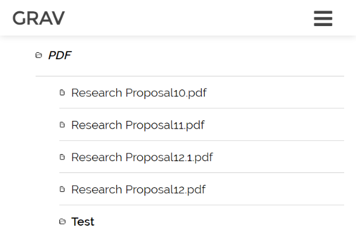

# [Grav](http://getgrav.org/) Directory Listing Plugin

Returns a hierarchy of pages and media below the page through Twig, stylized as a collapsible tree-structure:



## Installation and Configuration

1. Download the zip version of [this repository](https://github.com/OleVik/grav-plugin-directorylisting) and unzip it under `/your/site/grav/user/plugins`.
2. Rename the folder to `directorylisting`.

You should now have all the plugin files under

    /your/site/grav/user/plugins/directorylisting

The plugin is enabled by default, and can be disabled by copying `user/plugins/directorylisting/directorylisting.yaml` into `user/config/plugins/directorylisting.yaml` and setting `enabled: false`.

### Options

| Variable | Default | Options | Note |
|----------------|---------|-------------------|--------------------------------------------------------------------------|
| `enabled` | `true` | `true` or `false` | Enables or disables plugin entirely. |
| `level` | 1 | (int) 0-n | Initial level of folders to expand on load. |
| `max_depth`  | 3 | (int) 0-n | Depth at which to stop generating the tree. |
| `links` | `true` | `true` or `false` | Enables or disables links on file names. |
| `builtin_css` | `true` | `true` or `false` | Enables or disables the plugin's built-in CSS. |
| `builtin_js` | `true` | `true` or `false` | Enables or disables the plugin's built-in JavaScript. |
| `exclude_main` | `true` | `true` or `false` | Excludes the page-file, ie. the Markdown-.file, from the tree-structure. |
| `exclude_modular` | `true` | `true` or `false` | Excludes modular pages, ie. the modular folders from the tree-structure. |
| `order.by` | `date` | `default`, `folder`, `title`, `date` | Default - based on folder name; Folder - based on prefix-less folder name; Title - based on title field in header; Date - based on date field in header |
| `order.dir` | `desc` | `asc` or `desc` | Changes direction of ordering. |
| `exclude_additional` | null | List of files/folders | Excludes additional files/foldes from the tree-structure, as a YAML list. |
| `include_additional` | null | List of files/folders | Additional folders to include in the tree-structure, as a YAML list. |

By default all pages and media are recursively traversed in the same folder as the page, with the first level of folders expanded. Navigation is done by **clicking the folder-name**. This relies on the included [metisMenu](https://github.com/onokumus/metismenu/) jQuery-plugin and CSS.

Disabling `builtin_css` and `builtin_js` returns a simple hierarchical unordered HTML-list, which can be styled manually through your theme. With `exclude_main` enabled, the default Markdown-file is hidden. Disabling `links` will return just filenames, rather than filenames wrapped in a link to the file. The `level`-option sets how many levels deep the folders should expand on load.

Additional pages can be **excluded** by passing a list to `exclude_additional`, and additional pages can be **included** by passing a list to `include_additional`. In either case, **page-routes are used**, ie., use `/blog` not `02.blog`.

#### Usage

Simply include the following in your Twig-templates:

```
{{ directorylisting }}
```

#### Advanced usage

You can configure the plugin-settings in individual page FrontMatter, for example:

```
---
title: 'Modular Page'
onpage_menu: true
body_classes: 'modular header-image fullwidth'
content:
  items: '@self.modular'
directorylisting:
  level: 5
  exclude_main: true
  exclude_modular: false
  include_additional:
   - "/blog"
  exclude_additional:
   - "/blog/week-15"
---
```

You can also call the plugin from the `directorylisting` Twig-function, for example:

```

{{ directorylisting(settings) }}
```

The multi-dimensional array of values passed to the function mirrors the plugin's settings exactly, and is merged with the plugin's general settings.

**Note:** As with Grav itself, you should avoid a large amount of subfolders and files underneath user/pages. As the plugin recursively iterates below any page whose template uses the Twig-tag, a large amount of files (numerically, not in size), could slow performance. If the site is cached, this will not be noticeable even with thousands of files.

MIT License 2017 by [Ole Vik](http://github.com/olevik).
