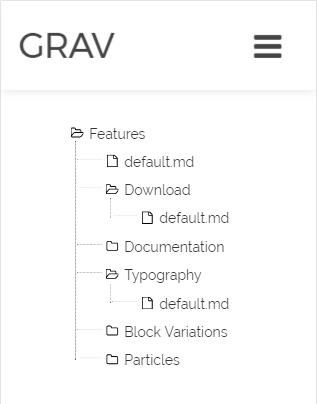

# [Grav](http://getgrav.org/) Directory Listing Plugin

Returns a hierarchy of files below the page through Twig, stylized as a collapsible tree-structure:



## Installation and Configuration

1. Download the zip version of [this repository](https://github.com/OleVik/grav-plugin-directorylisting) and unzip it under `/your/site/grav/user/plugins`.
2. Rename the folder to `directorylisting`.

You should now have all the plugin files under

    /your/site/grav/user/plugins/directorylisting

The plugin is enabled by default, and can be disabled by copying `user/plugins/directorylisting/directorylisting.yaml` into `user/config/plugins/directorylisting.yaml` and setting `enabled: false`.

## Example

```
{{ directorylisting }}
```

MIT License 2017 by [Ole Vik](http://github.com/olevik).
